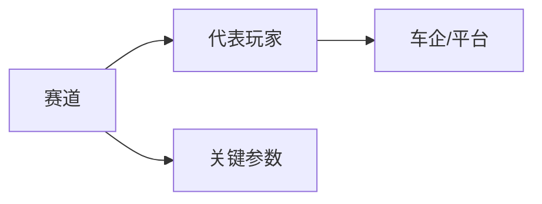
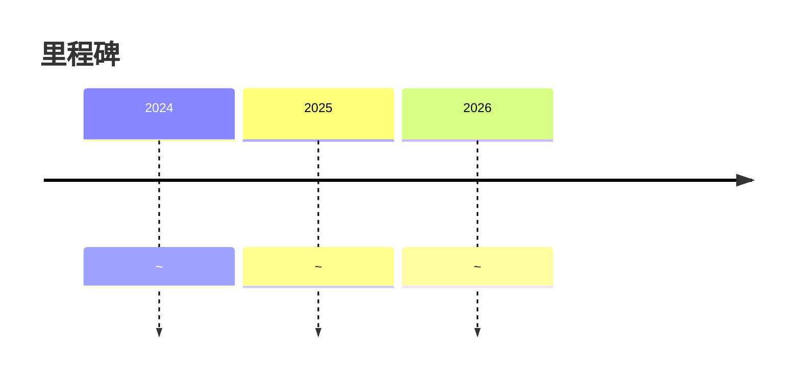

# 赛道名称

## 定位/主营业务

填写赛道定义、客户、商业模式、运营约束和商业化阶段。

## 产品矩阵

| 产品/车辆 | 定位 | 芯片 | 算力TOPS | 传感器 | 关键指标 |
| --- | --- | --- | --- | --- | --- |
| ~ | ~ | ~ | ~ | ~ | ~ |

## 赛博汽车评测角度与打分

> 评分为仓库内部整理分，依据《赛博汽车》账号文章中的实测、横评、访谈和商业化观察提取评测角度；不是赛博汽车官方分数。

| 维度 | 权重 | 赛博汽车依据 | 打分观察点 |
| --- | --- | --- | --- |
| ~ | ~ | ~ | ~ |

当前赛博口径评分：`~ / 100`

## 合作关系

## 里程碑

## 一句话点评

~
