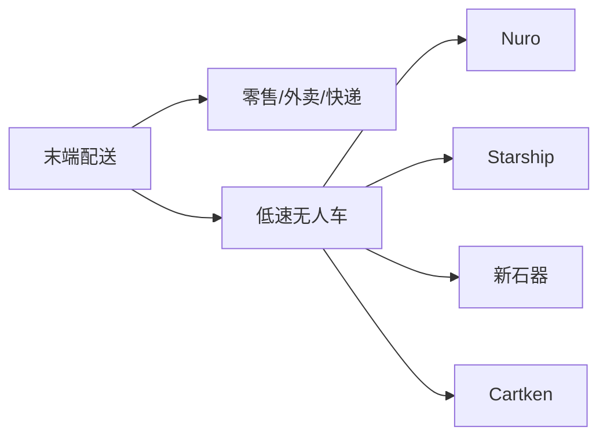
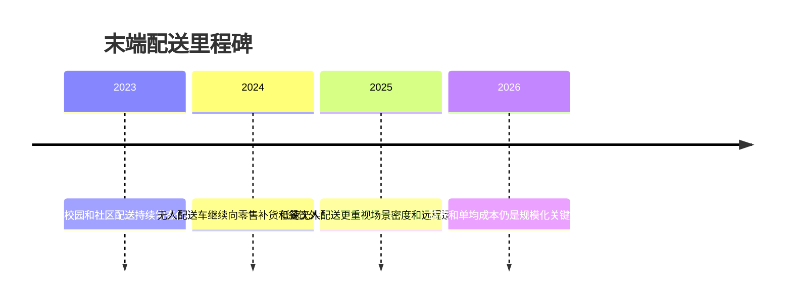

# 末端配送

## 定位/主营业务

末端配送以低速、小载荷、高频短途为核心特征，商业价值来自人力替代、峰值运力补充和封闭/半封闭场景中的稳定运营。它通常比开放道路载客更容易先落地，但单车收入天花板较低。

## 产品矩阵

| 产品/车辆 | 定位 | 芯片 | 算力TOPS | 传感器 | 关键指标 |
| --- | --- | --- | --- | --- | --- |
| Nuro Driver | 无人配送车辆平台 | ~ | ~ | 多传感器融合 | 零售/餐饮配送 |
| Starship Robot | 人行道配送机器人 | ~ | ~ | 摄像头/超声波/雷达配置依版本 | 校园和社区订单 |
| Neolix X 系列 | 无人配送/零售车 | ~ | ~ | 多传感器融合 | 场景投放规模 |
| Cartken Robot | 低速配送机器人 | ~ | ~ | 摄像头为主 | 商圈/校园配送 |

## 赛博汽车评测角度与打分

> 评分为仓库内部整理分，依据《赛博汽车》账号对白犀牛访谈、菜鸟/九识无人配送文章中的体验和运营观察；不是赛博汽车官方分数。

| 维度 | 权重 | 赛博汽车依据 | 打分观察点 |
| --- | --- | --- | --- |
| 行人交互安全 | 20 | 白犀牛访谈把公众容忍度和监管容忍度视为规模化前提，低速无人配送首先要不打扰、不惊吓行人。 | 人车混行避让、路口/小区门口通过、低速急停、逆行/占道投诉。 |
| 无图与端到端泛化 | 20 | 访谈提出 2026 年无人配送将跨入无图和端到端阶段，这是从示范到泛化的技术拐点。 | 新区域部署成本、临时障碍泛化、地图依赖、长尾场景处理。 |
| 取货/交接体验 | 15 | 赛博汽车无人配送内容关注无人车能否像成熟配送员一样完成用户侧交接，而不只是“车能开”。 | 用户找车、开舱、取货、超时、退货/异常件处理。 |
| 全流程自动化 | 20 | 文章关注无人配送能否像成熟司机一样完成装载、行驶、交接、异常处理等全链路。 | 装载、调度、行驶、交接、充电、维保是否少人工介入。 |
| 远程脱困 | 15 | 无人配送从规模走向成熟要看运营稳定性，远程脱困能力直接影响人力替代率。 | 接管频次、脱困时长、人车比、远程客服和现场救援成本。 |
| 场景密度与路权合规 | 10 | 访谈强调“规模不等于成熟”，要看车辆密度、运营稳定性和监管/公众容忍度。 | 单城订单密度、路权许可、社区接受度、监管试点边界。 |

当前赛博口径评分：`68 / 100`。按赛博汽车评测角度，无人配送已经具备场景价值，但成熟度要看行人交互安全、取货体验、远程脱困和全流程自动化，而不只是投放车辆数量。

## 合作关系

## 里程碑

## 一句话点评

末端配送更像低速机器人业务，规模化取决于高密度订单和稳定路权，而不是单车技术指标。
