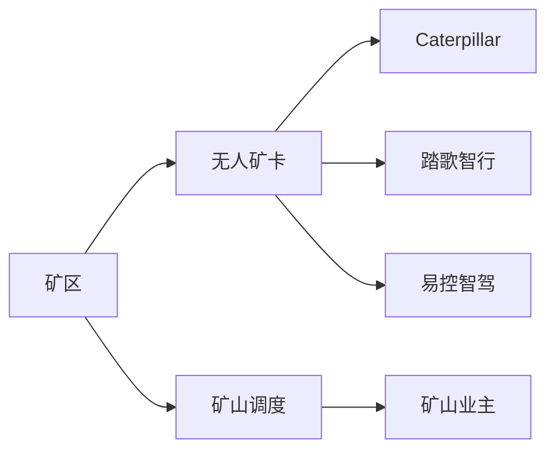
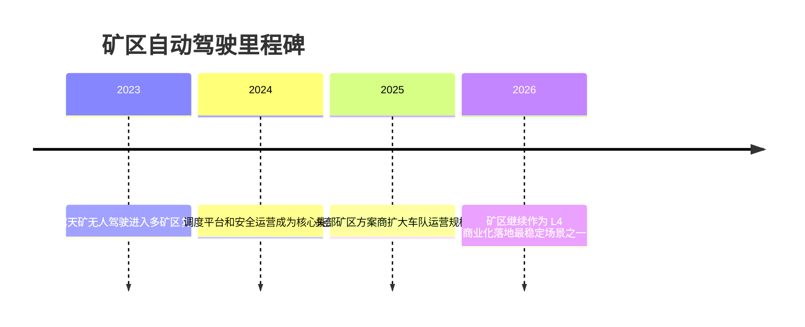

# 矿区

## 定位/主营业务

矿区自动驾驶是封闭低速重载场景，商业价值来自安全提升、连续作业和司机人力替代。矿区路线相对固定，但工况恶劣、载重高，对车辆控制、可靠性和调度系统要求很高。

## 产品矩阵

| 产品/车辆 | 定位 | 芯片 | 算力TOPS | 传感器 | 关键指标 |
| --- | --- | --- | --- | --- | --- |
| Cat MineStar Command | 矿山无人运输系统 | ~ | ~ | 多传感器融合 | 无人矿卡规模 |
| 踏歌智行矿区方案 | 无人矿卡系统 | ~ | ~ | 多传感器融合 | 连续作业和安全 |
| 易控智驾矿区方案 | 无人矿卡运营平台 | ~ | ~ | 多传感器融合 | 调度效率 |

## 赛博汽车评测角度与打分

> 评分为仓库内部整理分，依据《赛博汽车》账号对易控智驾等矿区无人驾驶玩家的商业化报道提取评测角度；不是赛博汽车官方分数。

| 维度 | 权重 | 赛博汽车依据 | 打分观察点 |
| --- | --- | --- | --- |
| 重载行驶安全 | 25 | 赛博汽车对矿区玩家的报道把安全生产和无人矿卡常态化运营放在核心位置。 | 坡道制动、重载会车、盲区避让、装载区/卸载区安全、夜间作业。 |
| 连续作业可靠性 | 20 | 相关报道关注无人矿卡数量、运营矿区数量和累计运营里程，核心是常态化而非演示。 | 出勤率、连续作业时长、故障率、人工安全员配置、累计运营里程。 |
| 调度协同 | 20 | 矿区场景成熟度取决于无人矿卡、装载、卸载、排土和调度平台协同。 | 车队调度、铲装协同、排队等待、排土路径、生产系统对接。 |
| 远程监管与应急 | 15 | 矿区高强度封闭场景仍需要远程运营、现场运维和应急处置共同保障。 | 接管频次、远程监控人车比、故障停车、现场救援、责任记录。 |
| 单吨成本 | 10 | 报道把矿区无人驾驶与新能源矿卡、运输成本下降和安全生产联系在一起。 | 人力替代、能耗、维修、补能、轮胎损耗对单吨成本的影响。 |
| 恶劣工况适应 | 10 | 矿区报道默认以真实露天矿高强度工况作为商业化验证场。 | 粉尘、雨雪、泥泞、震动、传感器污染、通信弱覆盖。 |

当前赛博口径评分：`86 / 100`。按赛博汽车评测角度，矿区无人驾驶成熟度最高，核心继续看重载安全、连续作业、调度协同和恶劣工况可靠性。

## 合作关系

## 里程碑

## 一句话点评

矿区自动驾驶的商业化逻辑清晰，关键是能否在高强度工况下证明安全、可靠和长期降本。
