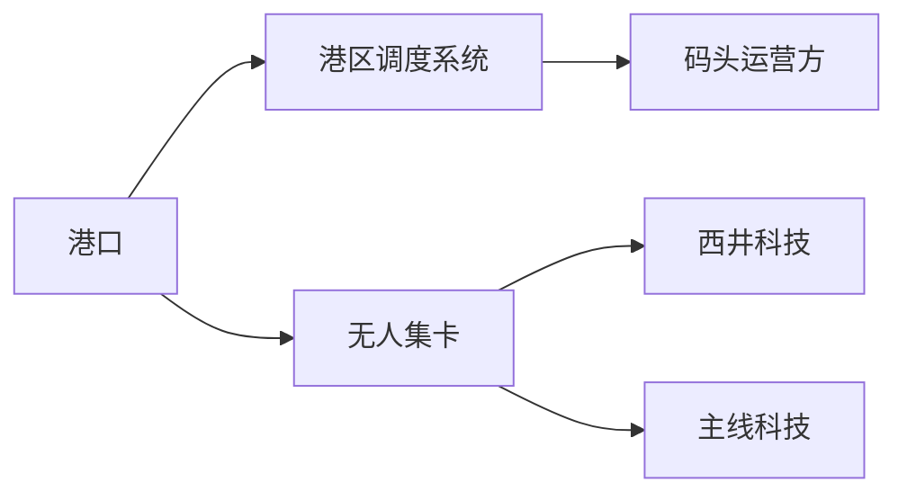
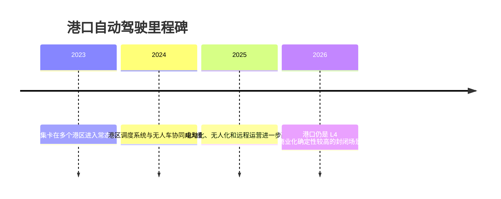

# 港口

## 定位/主营业务

港口是封闭场景自动驾驶的成熟落点之一，车辆通常在港区内部进行集装箱水平运输。由于道路规则清晰、路线固定、调度系统集中，港口更适合较早实现无人化和车队规模运营。

## 产品矩阵

| 产品/车辆 | 定位 | 芯片 | 算力TOPS | 传感器 | 关键指标 |
| --- | --- | --- | --- | --- | --- |
| Westwell Q-Truck | 无人驾驶电动集卡 | ~ | ~ | 多传感器融合 | 港区吞吐效率 |
| Trunk Port Truck | 港口自动驾驶卡车 | ~ | ~ | 多传感器融合 | 调度协同 |
| Fernride Platform | 远程驾驶 + 自动化物流 | ~ | ~ | 多传感器融合 | 远程运营效率 |

## 赛博汽车评测角度与打分

> 评分为仓库内部整理分，依据《赛博汽车》账号对西井科技、港口无人驾驶商业化的报道观察提取评测角度；不是赛博汽车官方分数。

| 维度 | 权重 | 赛博汽车依据 | 打分观察点 |
| --- | --- | --- | --- |
| 港区作业安全 | 20 | 港口无人驾驶报道默认以常态化作业为验证场，安全要覆盖港区人车混行、重载低速和堆场交叉口。 | 交叉口避让、重载制动、人员/设备识别、异常停车、夜间和雨雾作业。 |
| 调度协同体验 | 25 | 港口无人驾驶商业化不只是单车智能，还要和港区调度、车路云、补能系统协同。 | TOS/调度系统对接、任务派发、排队等待、交通冲突消解、远程看板。 |
| 装卸/堆场效率 | 20 | 场景成熟度要看常态化无人集卡数量和吞吐效率，而不是演示车。 | 单任务耗时、桥吊/堆场等待、吞吐效率、无人集卡利用率。 |
| 远程监管 | 15 | 港区无人驾驶需要远程运营和现场调度一起算账，远程监管决定人力替代率。 | 接管频次、远程监管人车比、异常任务闭环、现场救援。 |
| 能源补给与运维 | 10 | 港区无人车需要补能、维修、远程运营和现场调度一起算账。 | 自动充换电、维护窗口、传感器清洁、故障恢复。 |
| 跨港复制 | 10 | 报道关注从单港示范走向多港部署和海外港口拓展。 | 不同港区规则适配、部署周期、海外合规、系统复用率。 |

当前赛博口径评分：`78 / 100`。按赛博汽车评测角度，港口场景优势在规则清晰和系统可控；真正要测的是作业安全、调度协同、装卸效率和跨港复制。

## 合作关系

## 里程碑

## 一句话点评

港口的胜负手在系统集成和调度效率，车辆自动驾驶只是整体港区自动化的一环。
