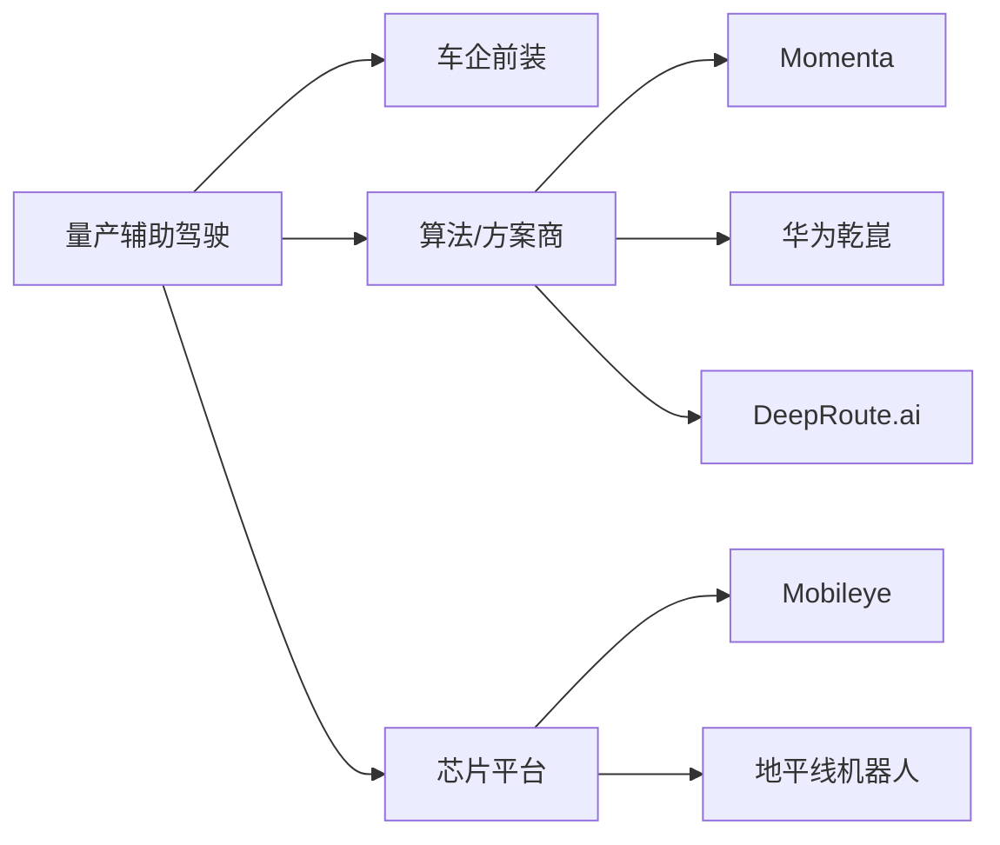
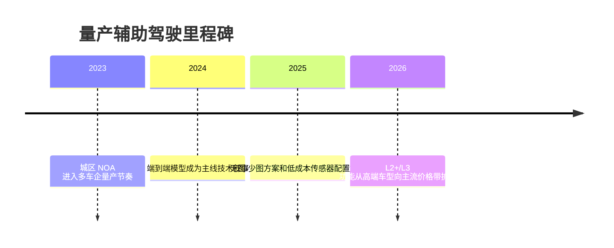

# 量产辅助驾驶

## 定位/主营业务

量产辅助驾驶是自动驾驶商业化规模最大的垂类，核心客户是车企和终端私家车用户。其商业化路径不是单独运营车队，而是通过前装硬件、软件功能包、订阅服务和持续 OTA 提升车辆智能化。

## 产品矩阵

| 产品/车辆 | 定位 | 芯片 | 算力TOPS | 传感器 | 关键指标 |
| --- | --- | --- | --- | --- | --- |
| Mobileye SuperVision | 前装高阶辅助驾驶 | EyeQ | ~ | 摄像头为主 | 前装车型覆盖 |
| 华为乾崑 ADS | 车企智驾方案 | MDC/车企平台 | ~ | 摄像头/雷达/激光雷达配置依车型 | 城区 NOA |
| Momenta Mpilot | 数据飞轮量产方案 | 依客户平台 | ~ | 多传感器配置依车型 | 量产客户规模 |
| DeepRoute Driver | 量产智驾方案 | 依客户平台 | ~ | 可选激光雷达/无图方案 | 成本与泛化 |

## 赛博汽车评测角度与打分

> 评分为仓库内部整理分，主要依据《赛博汽车》L2 横评中对 ACC、车道保持、弯道组合控制、紧急避险、目标识别切换、DMS 和成本的实测维度；不是赛博汽车官方分数。`57` 近似对应该横评样本的平均表现，不代表所有量产辅助驾驶产品的当前水平。

| 维度 | 权重 | 赛博汽车依据 | 打分观察点 |
| --- | --- | --- | --- |
| 跟车控制ACC | 15 | L2 横评把 ACC 跟车和速度控制列为辅助驾驶基础能力。 | 起停跟车、加减速自然度、前车切入、目标丢失后的恢复。 |
| 车道保持 | 15 | L2 横评将车道居中/保持作为智能行车核心项目。 | 居中稳定性、车道线不清、匝道/宽车道、驾驶员信心。 |
| 弯道组合控制 | 15 | 横评关注弯道组合控制，考验系统对道路曲率和横向控制的连续处理。 | 入弯减速、弯中居中、出弯加速、连续弯稳定性。 |
| 紧急避险 | 15 | 横评把紧急避险/主动安全作为关键项目，直接对应行驶安全。 | AEB、突然障碍、行人/两轮车、误触发和漏触发。 |
| 目标切换识别 | 10 | 横评关注目标切换识别，反映系统在前车消失、旁车切入时的感知稳定性。 | 前车切换、加塞识别、静止目标、施工锥桶和异形障碍。 |
| 自动变道/NOA | 15 | L2 横评将自动变道/高速辅助作为高阶能力观察点，后续赛博汽车也持续关注城区/高速 NOA 体验。 | 变道决策、打灯交互、导航跟随、匝道进出、驾驶员可控感。 |
| 驾驶员注意力监测 | 10 | 横评包含驾驶员注意力监测，强调 L2 仍需人类驾驶员负责。 | DMS 提醒准确性、脱手/视线检测、接管提示、误报疲劳。 |
| 功能成本 | 5 | 横评包含选装成本/功能价格，影响普通用户能否真实使用。 | 选装价格、硬件门槛、订阅费用、功能可用区域。 |

当前赛博口径评分：`57 / 100`。这个分数只代表赛博汽车早期 L2 横评样本的平均水平；后续新增具体车型实测时，应拆到车型页而不是覆盖整个赛道。

## 合作关系

## 里程碑

## 一句话点评

量产辅助驾驶的竞争焦点是“泛化能力 × 成本 × 前装规模”，它也是最容易形成数据飞轮的自动驾驶赛道。
