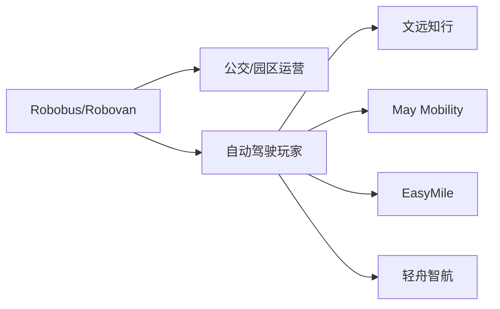
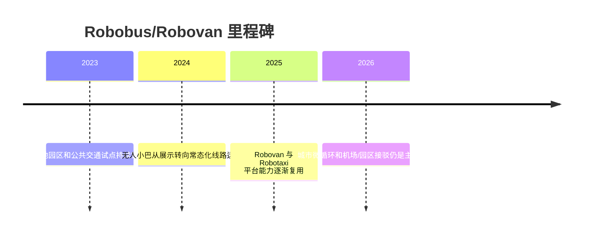

# Robobus/Robovan

## 定位/主营业务

Robobus/Robovan 主要服务固定路线和中低速接驳，适合园区、机场、景区、公交支线和城市微循环。相比 Robotaxi，它牺牲部分路径自由度，换取更清晰的运营边界和审批条件。

## 产品矩阵

| 产品/车辆 | 定位 | 芯片 | 算力TOPS | 传感器 | 关键指标 |
| --- | --- | --- | --- | --- | --- |
| WeRide Robobus | 无人小巴 | ~ | ~ | 多传感器融合 | 固定路线运营 |
| EasyMile EZ10 | 无人接驳车 | ~ | ~ | 多传感器融合 | 园区/机场接驳 |
| May Mobility AV | 自动驾驶接驳服务 | ~ | ~ | 多传感器融合 | 公共交通合作 |
| QCraft Robobus | 城市微循环接驳 | ~ | ~ | 多传感器融合 | 车队运营 |

## 赛博汽车评测角度与打分

> 评分为仓库内部整理分，依据《赛博汽车》账号关于 Robovan 合规身份、无人配送系统集成的文章提取评测角度；不是赛博汽车官方分数。这里的赛博口径主要覆盖 Robovan/无人配送车，Robobus 小巴暂无对应专门评测。

| 维度 | 权重 | 赛博汽车依据 | 打分观察点 |
| --- | --- | --- | --- |
| 座舱/货舱体验 | 15 | Robovan 合规文章讨论无人厢式车身份，实际评测要落到乘客/货物在无驾驶员空间中的交互和安全感。 | 车内提示、开关门、货舱开闭、乘客扶手/站立体验、货物固定。 |
| 固定线路行驶安全 | 20 | 文章把功能安全、数据合规、远程监管和应急处置列为制度化要求。 | 低速避障、站点进出、会车、非机动车/行人混行、急停舒适性。 |
| 站点停靠与上下客/装卸 | 15 | Robobus/Robovan 的体验不只在行驶，还在固定线路站点和货物交接是否顺畅。 | 靠站精度、开门时机、上下客效率、货物装卸、站点调度。 |
| 远程监管与应急处置 | 20 | Robovan 合规落地需要远程监管、应急处置和运营闭环。 | 接管频次、远程监管人车比、乘客/货主求助入口、故障停车和救援。 |
| 可解释可追溯与数据合规 | 15 | 合规文章强调自动驾驶系统要可解释、可追溯、可纠偏，才能从试点走向制度化。 | 事件记录、责任界定、数据采集合规、算法问题复盘。 |
| 系统集成 | 15 | 菜鸟/九识文章把无人配送从单车突破推向供应链服务、KA 客户和系统集成。 | 与公交/园区/物流调度系统对接、线路排班、场站运维、客户后台。 |

当前赛博口径评分：`66 / 100`。按赛博汽车评测角度，Robovan/Robobus 的关键不只是“能不能上路”，还要看乘客/货主体验、固定线路安全、远程监管和系统集成。

## 合作关系

## 里程碑

## 一句话点评

Robobus/Robovan 是 L4 技术的“低速半封闭试验田”，关键不在车辆炫技，而在站点调度、线路密度和公共交通合作。
