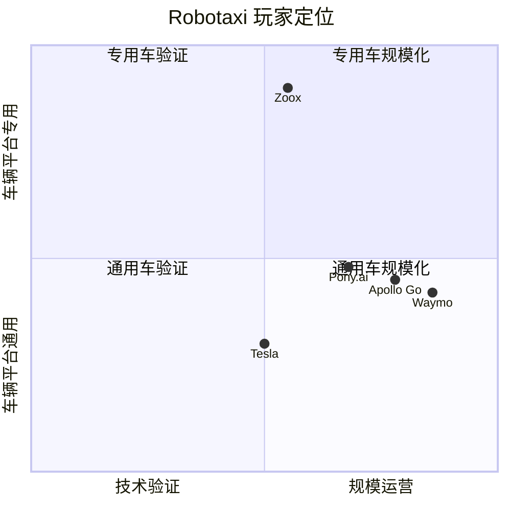
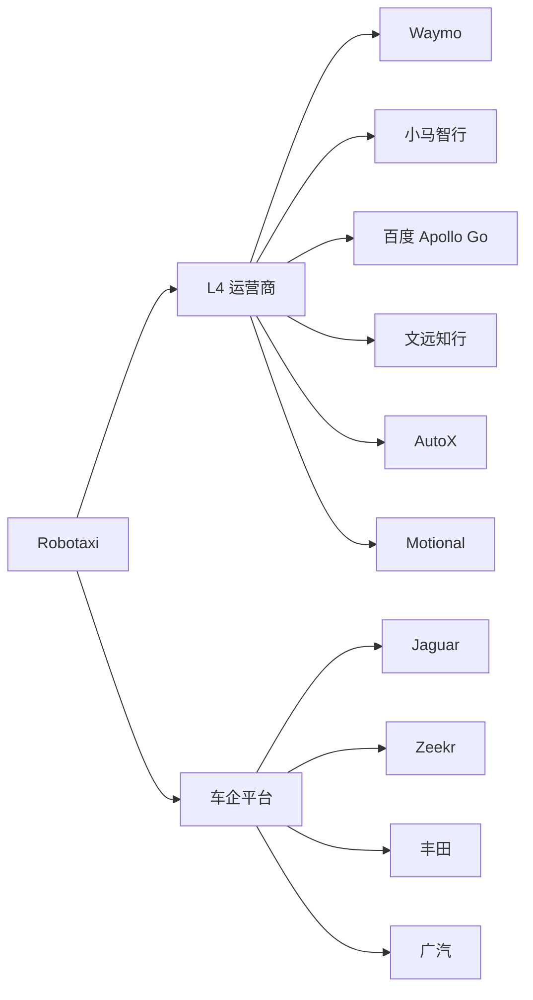
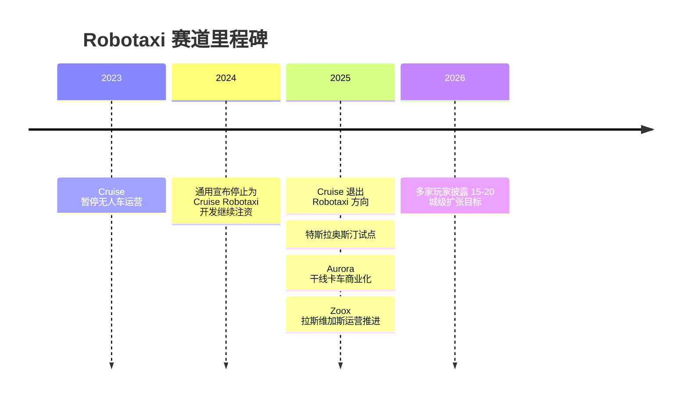

# Robotaxi

## 定位/主营业务

Robotaxi 是 L4 载客自动驾驶商业化最具标志性的场景。商业逻辑的核心是单位经济模型：传统网约车成本中的司机抽成如果能转化为平台毛利，Robotaxi 才可能形成规模化盈利；因此“去安全员”通常是盈利分水岭。

## 产品矩阵

| 产品/车辆 | 定位 | 芯片 | 算力TOPS | 传感器 | 关键指标 |
| --- | --- | --- | --- | --- | --- |
| Waymo One | 美国 Robotaxi 出行服务 | ~ | ~ | 激光雷达/摄像头/毫米波雷达 | 车队规模、城市复制 |
| PonyPilot | 中国 Robotaxi 出行服务 | ~ | ~ | 激光雷达/摄像头/毫米波雷达 | 单车经济模型、城市开放 |
| Apollo Go | 中国 Robotaxi 出行服务 | ~ | ~ | 多传感器融合 | 订单密度、无人化比例 |
| Zoox | 专用 Robotaxi 车辆 | ~ | ~ | 多传感器融合 | 专用车型量产与运营许可 |

## 赛博汽车评测角度与打分

> 评分为仓库内部整理分，依据《赛博汽车》账号 Robotaxi 实测和《Robotaxi商业化落地，遥遥无期》中的体验观察；不是赛博汽车官方分数。

| 维度 | 权重 | 赛博汽车依据 | 打分观察点 |
| --- | --- | --- | --- |
| 叫车与上下车体验 | 15 | 实测和商业化文章都把叫车、等待、上车、下车、绕行是否像日常网约车作为体验入口。 | 等待时间、上车点可达性、车内提示、目的地确认、绕行和临停体验。 |
| 座舱/乘坐体验 | 15 | Robotaxi 实测问题意识集中在“这体验能打几分”，包含乘客在无司机座舱里的安心感和交互清晰度。 | 车内屏/语音提示、乘客确认按钮、隐私感、乘坐舒适性、是否需要乘客频繁理解系统状态。 |
| 行驶平顺性 | 15 | Robotaxi 实测通常会关注车辆是否顺畅，是否出现突兀加减速、犹豫、绕行或急刹。 | 起步、跟车、变道、路口通过、靠边停车是否自然。 |
| 行驶安全 | 20 | 文章把事故责任、监管收紧和公众信任作为核心风险，实测也会追问无人车到底安不安全。 | 交通规则遵守、行人/非机动车避让、紧急制动、复杂路口和施工场景表现。 |
| 真无人程度 | 15 | 文章区分主驾安全员、副驾安全员和全车无人，真无人是商业化拐点。 | 车内是否有安全员、远程接管频次、乘客是否感知到人工介入。 |
| 异常接管与责任 | 10 | 文章把接管、事故责任和监管许可作为 Robotaxi 体验能否被信任的关键。 | 远程接管透明度、事故处置、客服/救援响应、责任链路。 |
| 运营边界 | 10 | 文章把能否离开示范区、能否像网约车一样接单作为关键观察点。 | ODD 区域、上下车点限制、天气/时段限制、跨城复制能力。 |

当前赛博口径评分：`55 / 100`。按赛博汽车实测角度，Robotaxi 的乘坐新鲜感已经成立，但行驶安全信任、真无人程度、接管透明度和日常网约车式体验仍是扣分点。

## 玩家定位

## 合作关系

## 里程碑

## 一句话点评

Robotaxi 的长期空间很大，但短期胜负手不是演示能力，而是去安全员后的车队周转率、城市复制成本和事故责任边界。
