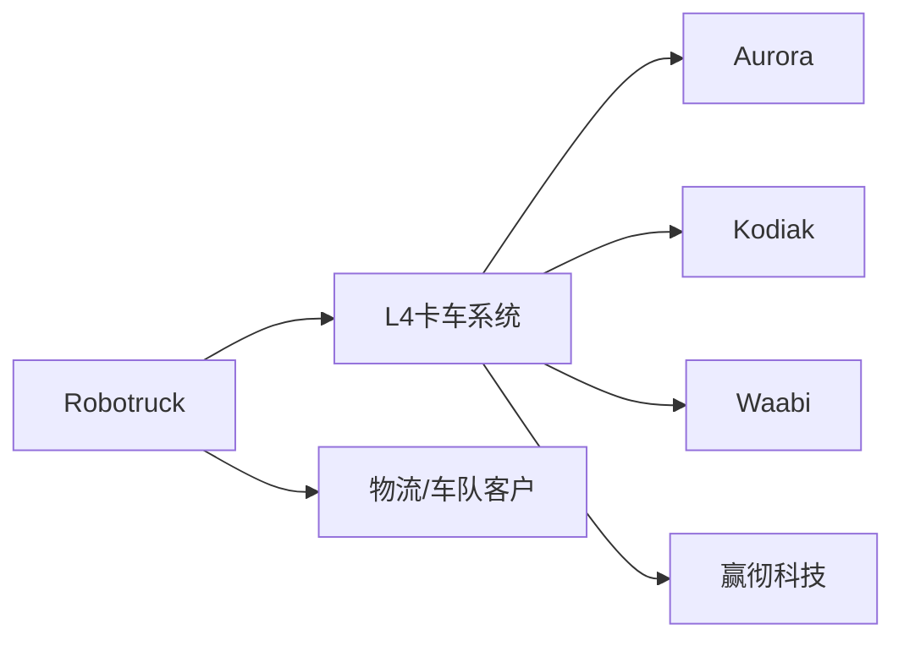
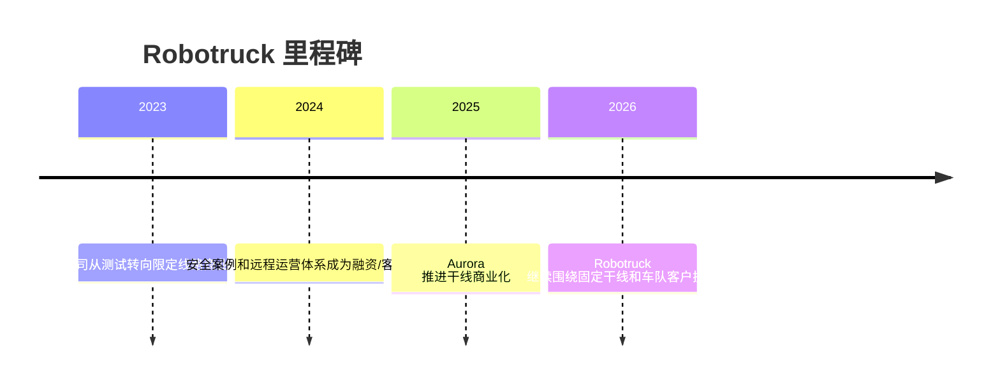

# Robotruck

## 定位/主营业务

Robotruck 的核心目标是降低干线物流司机成本、提升车队利用率并减少事故风险。相比 Robotaxi，Robotruck 的道路类型更集中、路线更稳定，但重载高速工况对安全冗余和车规可靠性要求更高。

## 产品矩阵

| 产品/车辆 | 定位 | 芯片 | 算力TOPS | 传感器 | 关键指标 |
| --- | --- | --- | --- | --- | --- |
| Aurora Driver | 干线卡车 L4 系统 | ~ | ~ | 激光雷达/摄像头/雷达 | 商业货运线路 |
| Kodiak Driver | 模块化无人卡车系统 | ~ | ~ | SensorPods 多传感器 | 远程监控与冗余 |
| Waabi Driver | AI-first 自动驾驶卡车系统 | ~ | ~ | 多传感器融合 | 仿真训练与安全验证 |
| 轩辕系统 | 中国干线卡车量产方案 | ~ | ~ | 多传感器融合 | 前装车型与物流客户 |

## 赛博汽车评测角度与打分

> 评分为仓库内部整理分，依据《赛博汽车》账号关于 Robotruck 商业拐点、卡尔动力 L4 编队货运和自动驾驶卡车困境的文章提取评测角度；不是赛博汽车官方分数。

| 维度 | 权重 | 赛博汽车依据 | 打分观察点 |
| --- | --- | --- | --- |
| 重载行驶安全 | 25 | 自动驾驶卡车文章把高速重载安全、责任和法规作为持续难题。 | 高速并线、跟车距离、重载制动、障碍物识别、恶劣天气和夜间表现。 |
| 编队/跟车控制 | 15 | 卡尔动力 L4 编队货运报道强调编队模式和全流程无人，是 Robotruck 从演示到运输服务的关键体验。 | 车队协同、前后车响应、队列稳定性、编队解散/重组。 |
| 门到门无人闭环 | 20 | 赛博汽车关注 Robotruck 能否从高速干线延伸到场站、装卸、接驳等完整货运流程。 | 出库、上高速、到站、入场、装卸对接、异常脱困是否少依赖人工。 |
| 货运任务完成度 | 15 | 《Robotruck驶入商业拐点》把从烧钱研发转向运力变现作为拐点，背后要求真实运单可完成。 | 准点率、取消率、空驶率、客户货量稳定性、路线可复制。 |
| 远程接管与责任 | 15 | 自动驾驶卡车文章把责任链路、保险和监管作为高风险重载场景必须回答的问题。 | 接管频率、远程接管时延、事故责任、保险和应急预案。 |
| 车辆可靠性与运维 | 10 | 商业化文章关注从改装车走向可维护、可量产的车队资产。 | 出勤率、传感器清洁、补能/维修效率、前装平台成熟度。 |

当前赛博口径评分：`72 / 100`。按赛博汽车评测角度，Robotruck 已经能进入真实货运验证，但高重载安全、门到门无人闭环和远程责任链路仍决定上限。

## 合作关系

## 里程碑

## 一句话点评

Robotruck 的商业化阻力较小于开放城区载客，但真正难点在于长周期安全验证、保险责任和重资产车队运营。
